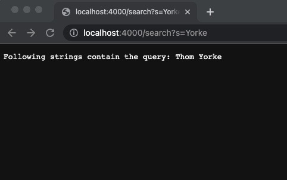

# CSE 15L Fall 2022 Lab Report 2


Hello and welcome to lab reports for CSE 15L. This week we will learn how to write a simple search engine and fixing bugs in code examples

## Part 1: Simple Search Engine from Week 2

### SearchEngine.java
```
import java.io.IOException;
import java.net.URI;
import java.util.ArrayList;

/**
 * Boiler Plate Code copied from NumberServer.java
 */

 
/**
 * Handler that handles requests, interacts with the storage
 * accesses it and manipulate it.
 */
class Handler implements URLHandler {

    //Identifier for invalid query. DO NOT SHARE. Update if leaked.
    String invalidQueryIndentifier = "5d6870408eba79cbf114";

    /**
     * Storage of the list of strings that will be accessed 
     * and manipulated by the user
     */
    ArrayList<String> listOfStrings = new ArrayList<String>();

    /**
     * Split the query in the argument url.
     * Use = as the split operator to split around
     * @param url URL to split the query of
     * @return string list of split query around =
     */
    public String[] splitQuery(URI url) {
        return url.getQuery().split("=");
    }

    /**
     * Validate the given query by checking that format "s=abc" is 
     * being followed in the query
     * @param url Input URL
     * @return validated query string or invalid identifier
     */
    public String validateQuery(URI url) {

        //Splitting the query
        String[] query = splitQuery(url);

        //Check if first element is "s" otherwise return invalid query
        if (query[0].equals("s")) {
            return query[1];
        } 
        return invalidQueryIndentifier;
    }

    /**
     * The deafult path that webpage goes back to
     * @return webpage with the current list of strings
     */
    public String defaultPath() {
        return "Current list: " + String.join(", ", listOfStrings);
    }
    
    /**
     * Search function to search and find out if the given 
     * query is in one or more of the strings in the list of strings
     * @param url Input URL
     * @return Webpage with a list of strings that contain the query
     */
    public String search(URI url) {

        // Validate the query; make an arraylist to store correct strings
        String query = validateQuery(url);
        ArrayList<String> matchingResults = new ArrayList<String>();

        // Invalid query
        if (query.equals(invalidQueryIndentifier)) {
            return "Invalid Path and/or Query";
        }

        // Checking for every string in list of strings
        for (String string : listOfStrings) {
            //Add to matchingResults arraylist if string contains query
            if (string.contains(query)) {
                matchingResults.add(string);
            }
        }

        // If there is atleast one result then return the webpage
        if (matchingResults.size() > 0) {
            return (
                "Following strings contain the query: " + 
                String.join(", ", matchingResults)
            );
        }

        // No matching strings
        return "No Strings contained the given query :/";
    }

    /**
     * Add function to add the given query to the list of strings
     * @param url Input URL
     * @return Confirmation + Current list
     */
    public String add(URI url) {

        // Validate the query
        String query = validateQuery(url);

        // Invalid Query
        if (query.equals(invalidQueryIndentifier)) {
            return "Invalid Path and/or Query!";
        }

        // Add the query to the list of strings and return confirmation
        listOfStrings.add(query);
        return "Query Added! " + defaultPath();
    }

    /**
     * Handle the given requests in the form of URLs
     * @param url given request in the form of a url
     * @return The resulting webpage to be shown
     */
    public String handleRequest(URI url) {
        // Get the path
        String path = url.getPath();

        // Call function based on given path
        if (path.equals("/")) {
            return defaultPath();
        } else if (path.contains("/search")) {
            return search(url);
        } else if (path.contains("/add")) {
            return add(url);
        } else {
            return "404 Not Found; Invalid Path!";
        }
    }
}


/**
 * Contains the Main method
 */
public class SearchEngine {

    /**
     * Main method
     * Enter port number in command line argument to run
     * a local server on the designated port
     * Visit http://localhost:<port number> to see the server
     * @param args port number is 0th arg
     * @throws IOException
     */
    public static void main(String[] args) throws IOException {

        //Check if port number is specified
        if(args.length == 0){
            System.out.println("Missing port number! Try any number between 1024 to 49151");
            return;
        }

        //parse into string and start a server on the port
        int port = Integer.parseInt(args[0]);
        Server.start(port, new Handler());
    }
}
```

### Server.java (Note: Not my code, this is the code given in week 2 lab)
```
// A simple web server using Java's built-in HttpServer

// Examples from https://dzone.com/articles/simple-http-server-in-java were useful references

import java.io.IOException;
import java.io.OutputStream;
import java.net.InetSocketAddress;
import java.net.URI;

import com.sun.net.httpserver.HttpExchange;
import com.sun.net.httpserver.HttpHandler;
import com.sun.net.httpserver.HttpServer;

interface URLHandler {
    String handleRequest(URI url);
}

class ServerHttpHandler implements HttpHandler {
    URLHandler handler;
    ServerHttpHandler(URLHandler handler) {
      this.handler = handler;
    }
    public void handle(final HttpExchange exchange) throws IOException {
        // form return body after being handled by program
        try {
            String ret = handler.handleRequest(exchange.getRequestURI());
            // form the return string and write it on the browser
            exchange.sendResponseHeaders(200, ret.getBytes().length);
            OutputStream os = exchange.getResponseBody();
            os.write(ret.getBytes());
            os.close();
        } catch(Exception e) {
            String response = e.toString();
            exchange.sendResponseHeaders(500, response.getBytes().length);
            OutputStream os = exchange.getResponseBody();
            os.write(response.getBytes());
            os.close();
        }
    }
}

public class Server {
    public static void start(int port, URLHandler handler) throws IOException {
        HttpServer server = HttpServer.create(new InetSocketAddress(port), 0);

        //create request entrypoint
        server.createContext("/", new ServerHttpHandler(handler));

        //start the server
        server.start();
        System.out.println("Server Started! Visit http://localhost:" + port + " to visit.");
    }
}
```


### The code in action:


This is the default path. Upon calling this path, Handler.defaultPath() is called which just returns the current list of strings

#### Lets try adding some alt rock artist names and creating a list off that!


This is the add path. It uses the syntax /add?s=thingToAdd. Upon using this path, Handler.handleRequest() calls Handler.add() and passes in the url as one of the arguments. The add method uses the validate method to validate the query which uses the split method to split the query and make sure that its in form s=abc. If the query is invalid then the appropriate message is displayed. If its valid then ArrayList.add() method is called on listOfStrings to add the query in this case David Bowie to the list of Strings. After which a confirmation message is displayed.


What happened in the previous picture but with Thom Yorke in this case.


What happened in the previous two pictures but with multiple other artist names in this case.


Default Path after all the names have been added.

#### Now lets try using the search function to search some names

 

This is the search path. It uses the syntax search?s=thingToSearch. Upon using this path, Handler.handleRequest calls Handler.search() passes in the url as one of the arguments. The add method uses the validate method to validate the query which uses the split method to split the query and make sure that its in form s=abc. If the query is invalid then the appropriate message is displayed. If its valid then it searches if any of the strings in the listOfStrings contains the query through a for each loop on the array list. It adds all the elements that contain the query to a seperate list and then show the list. In this case it is using David (First Name) as the query to search for.

 

What happened in the previous picture but with Yorke (Last Name) in this case.

 

What happened in the previous two pictures but with Lou Reed (Full Name) in this case.


What happened in the previous three pictures but with vi (a common part of multiple names) in this case.


What happened in the previous four pictures but with a name that does not exist in the list, so it displays the appropriate error message.

#### Now lets try to fail the code and make sure its displaying appropriate messages


Lets say that I wanted to listen to Thom Yorke of Radiohead now so I put in the above command. It fails and shows the fail message because the path does not exist... yet.


When you try to add a name but then mistype the s to something else or forget it by mistake.


When you try to search a name but then mistype the s to something else or forget it by mistake.

## Part 2: Solving Bugs from the given files in week 3

### Reverse In Place:

#### Failure Inducing Input: 
{3, 4, 5} (In general, any array with a size greater than 1)

#### Test code:
```
    @Test
    public void testReverseInPlace1() {
        int[] input1 = { 3, 4, 5 };
        ArrayExamples.reverseInPlace(input1);
        assertArrayEquals(new int[]{ 5, 4, 3 }, input1);
    }
```
#### Symptom:
{5, 4, 5}  
The last element should be 3 but it is 5 instead. With bigger lists it would look worse like {3, 4, 5, 6, 7} would look like {7, 6, 5, 6, 7} instead of {7, 6, 5, 4, 3}   
Junit Output:


#### Bugs:
1: The code does not copy over arr[i] to arr[arr.length - i - 1] after copying arr[arr.length - i - 1] to arr[i]. For example: It results in something like this after the first iteration: {3, 4, 5, 6, 7} to {7, 4, 5, 6, 7} instead of {7, 4, 5, 6, 3}.  
2: The code goes till the last element which is wrong. It needs to stop at the middle as it is simultaneously flipping the elements of front and back. If it keeps going then the array would be reversed midway through but then reverse the reversed version back to the original version of the array.

#### Fixed Code:
```
 // Changes the input array to be in reversed order
 static void reverseInPlace(int[] arr) {
   for(int i = 0; i < (arr.length / 2); i += 1) {
       int temp = arr[i];
       arr[i] = arr[arr.length - i - 1];
       arr[arr.length - i - 1] = temp;
   }
 }
 ```
	
### Reversed:

#### Failure Inducing Input:  

{3, 4, 5} (In general a non-empty array)
	
#### Test Code:
```
    @Test
    public void testReversed1() {
   	    int[] input1 = { 3, 4, 5 };
   	    assertArrayEquals(new int[]{ 5, 4, 3 }, ArrayExamples.reversed(input1));
    }
```
#### Symptom:
{0, 0, 0}  
Every element is replaced with 0 when it should be {5, 4, 3}. 
Junit Output:  


#### Bug:
It is replacing arr elements with newArray elements which is the wrong way around. newArray elements are all 0’s so the output becomes all 0’s. Instead it should be replacing newArray elements with arr elements. It returns arr which is the original non reversed array instead of newArray which is the new reversed array.
#### Fixed Code:
```
 // Returns a *new* array with all the elements of the input array in reversed
 // order
 static int[] reversed(int[] arr) {
   int[] newArray = new int[arr.length];
   for(int i = 0; i < arr.length; i += 1) {
       newArray[arr.length - i - 1] = arr[i];
   }
   return newArray;
 }
 ```


### averageWithoutLowest:

#### Failure Inducing Input:
{1.0, 1.0, 1.0, 2.0, 3.0}  (in general, any array or an array with multiple instances of the lowest value.
#### Test Code:
```
    @Test
    public void testAverageWithoutLowest() {
        double[] input1 = { 1.0, 1.0, 1.0, 2.0, 3.0 };
        assertEquals(2.5, ArrayExamples.averageWithoutLowest(input1), 0);
    }
```

#### Symptom:
It returns 1.25 when instead the average of 2, 3 (1 is removed since its the lowest value) is 2.5.  
Junit Output:


#### Bug:
The average calculation is done wrong. It divides by the total number of elements in the whole array while it should be dividing by the total number of elements in the array when all the instances of the lowest element are removed. There is no count for how many lowest values are removed. There can be multiple instances of the lowest value therefore there is no way to know how many instances of lowest values were removed and what to divide by to find out the average Alternatively, you can keep a track of all the elements that are kept while calculating the sum and divide the sum by that number to get the desired result.

#### Fixed Code:
```
    // Averages the numbers in the array (takes the mean), but leaves out the
    // lowest number when calculating. Returns 0 if there are no elements or just
    // 1 element in the array
    static double averageWithoutLowest(double[] arr) {
        if(arr.length < 2) { return 0.0; }
        double lowest = arr[0];
        for(double num: arr) {
            if(num < lowest) { lowest = num; }
        }
        double sum = 0;
        int lengthCount = 0;
        for(double num: arr) {
            if(num != lowest) {
                sum += num;
                lengthCount++;
            }
        }
        return sum / lengthCount;
    }
}
```