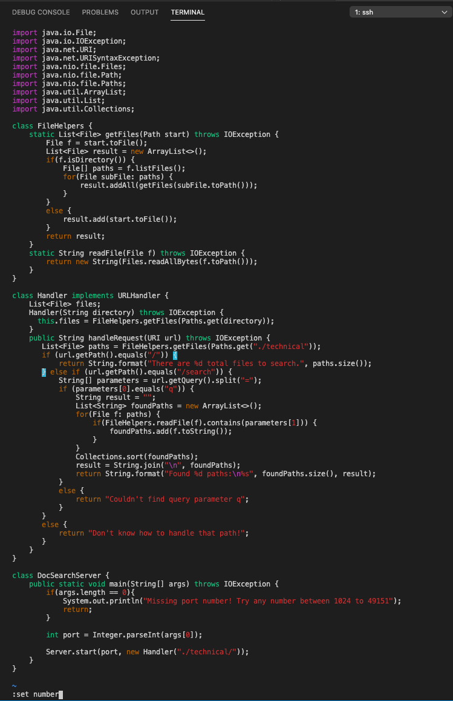

# CSE 15L Fall 2022 Lab Report 4


Hello and welcome to lab reports for CSE 15L. This week we will learn how to perform a lab task with vim in Part 1 and then how to edit on servers in part 2.

## Part 1

Fixing the first part, not included in tasks.
Navigate to the directory: ```cd week6-skill-demo1``` and then open the file using vim: ```vim TestDocSearch.java```

```
/10
dw
i
1391
Escape
:wq
```

This is what its going to look like after it is fixed


### Task 1

Description: In DocSearchServer.java, change the name of the start parameter of getFiles, and all of its uses, to instead be called base.

Open file: ```vim DocSearchServer.java ``` and replace all start occurrences with base

1. ```:set number```  
This Command is optional but it helps out a lot by line numbering which makes the code easier to navigate.


2. ```<Enter>```
Executing the above command.


3. ```/start```
Find the first occurence of start and figure out what line its on.


4. ```<Enter>```
Executing the above command.


5. ```:13,30s/start/base/g```
Between line 13 and 30 inclusive, replace all occurences of the word start with the word base.
13,30s/ being the lines between which we want to find and repalce
start/ being the word to find
base/ being the word to replace the find word with
/g 


6. ```<Enter>```
Executing the above command.


7. ```:wq```
This command just saves your changes and exits vim. w for saving q for exiting


8. ```<Enter>```
Executing the above command.


### Task 2

Description: In DocSearchServer.java, add a new line right before File[] paths = f.listFiles(); that prints out the toString of f and a message saying it’s a directory.

Open file: ```vim DocSearchServer.java ```

1. ```/File[] paths = f.listFiles();``` followed by ```<Enter>```


2. ```k```


3. ```$```


4. ```a```


5. ```<Enter>```


6. ```System.out.println(f.toString() + “is a directory”);```


7. ```<Escape>``` followed by ```:wq```


### Task 3

Description: In DocSearchServer.java, change the main method so that rather than hardcoding the search on the ./technical directory, it uses the second command-line argument for the path to search

Open file: ```vim DocSearchServer.java ```

1. ```/technical``` followed by ```<Enter>```


2. ```3h```


3. ```d$```


4. ```i``` followed by ```args[1]));```


6. ```<Escape>``` followed by ```:wq```


### Challenge Task

Since this is the challenge task and is not technically required, I'll just show the commands and the end result.

```
:set number
/public void testSearchCount()
<Enter>
k
6yy
5j
p
j
27l
i
2
<Escape>
/taxation
<Enter>
dw
i
tax
<Escape>
:wq
```


## Part 2

Both methods will be considered for task 1.

### Method 1:  
Once, start in Visual Studio Code and make the edit there, then scp the file to the remote server and run it there to confirm it works (you can just run bash test.sh on the remote to test it out). Consider having the appropriate scp command in your command history or easily copy-pasteable!

This took me 1 minute and 12 seconds.

1. Press Option + Command + F (This is for mac) to open up find and replace. Type in start for find and base for replace 
2. Spam enter till line 30
3. Press up arrow in terminal and Enter 

Done.


### Method 2:  
Second, start already logged into a ssh session. Then, make the edit for the task you chose in Vim, then exit Vim and run bash test.sh.

This took me 1 minute 54 seconds.

The method steps are described above in task 1.

It took me less time with visual studio code because I am more closely aquainted with it. Moreover, using a mouse to click and move around makes things significantly faster

In both cases I used find and replace but if I did not use that then it would be significantly more hard and tedious in vim that it is in vs code since you can just highlight then copy and then paste.

### Question 1:
Which of these two styles would you prefer using if you had to work on a program that you were running remotely, and why?

##### Answer
I will always prefer running on vscode first and editing the file locally and then scping the file over to the remote server instead of remotely editing the file using vim. 

There are many reasons for this. 
1. Making big code changes is much harder and time consuming on vim in comparision to vscode.  
Let us say for example I have multiple methods that I want to change and refer to my old code while doing that. In vscode I can open up both code files at the same time side to side and highlight copy paste code form old to the current file. In this way, I can change huge chunks of code in seconds just to try it out and revert back if I need to. In vim I would need to open two terminals to reference code and then I would not even be able to quickly code code from old to current. there are hoops I need to go through to use the system clipboard in vim.

2. vscode has code recommendation and library definitions while vim does not have these.  
In vscode, while typing repetitive code or redundant code, it will suggest you code to either type it faster or remove redundancy. Morever, whenever you hover over any method or property in vscode, it instantly shows you all the documentation of it from the library including the proper syntax and stuff. This is so incredibly helpful and it is what allowed me to learn and become good at coding. I learnt most of python by just thinking what I might want some inbuilt function to do, type it out in one word and see a code recommendation of a similar function, hover over it to see its short documentation and syntax and more often than not, it was the function I was looking for. I did not even need to go to the web or look up tutorials! If the documentation did not help or the function was not something I wanted then ofcourse I had to use the web but this was very very rare and I got most of my learning and information from vscode code recommendation and hover to see documentation for the function.

3. The near infinite amount of (mostly open source)extensions that tailor and personalize your experince in vscode exactly how you want it to be. These extentions are life saving. They complete chunks of code, write boiler code (imports and stuff), give better code highlight, give better navigation, allow you to run files or individual tests, methods and, functions on go, etc. This allows you to customize your experince and make it as comfortable as possible. In contrast vim seems hostile due to eithe the difficulty/lack of customizability of the code editor.

Now, these reasons may seem biased and unfair because they are. vim is a lot lighter on system resources and can run on remote command line servers while vscode cant. This is its main advantage but in my opinion, for large projects that need contanst maintanence and updates, It will never be worth it to do them on vim for me. The cons of vim in comparision to vscode outweigh its benefits.

### Question 2:
What about the project or task might factor into your decision one way or another? (If nothing would affect your decision, say so and why!)

#### Answer
Almost nothing would affect my decision because of the descriptive reasons I stated above. I will always use method 1 of using vs code locally and then scping on remote server.

But, the only case where I would prefer using vim over vscode would be if the code changes are very small like 1-2 lines. In that case vim is acceptable for me. Or if I had to change some datafile values (eg: CSS) and need to look at its results in real time. It would save time to not scp every little change instead just use vim to make it faster. 

I kind of disagree with scping changes as well. If my project is on github then I would make changes locally and put that change on a branch. Fetch the branch on the remote server, pull it to the remote server and then test the branch there. If it succeeds then shift the branch to main and make the current main a older version. pull these changes again to the remote server. This would be my preferred way of handling projects.