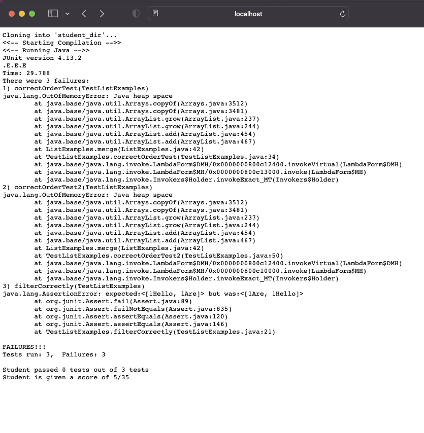
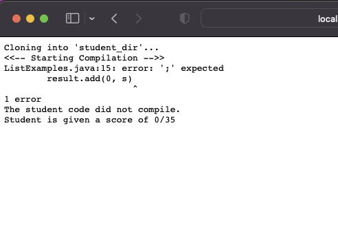
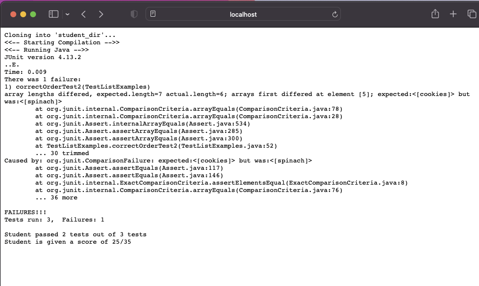
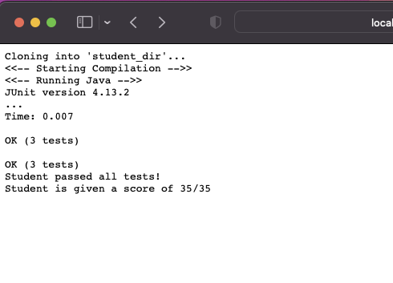

# CSE 15L Fall 2022 Lab Report 3


Hello and welcome to lab reports for CSE 15L. This week, we will create and use a grading script to grade TestListExamples from Lab3

## grade.sh script
```
rm -rf $"student_dir"
git clone $1 $"student_dir" || exit 1 

# Total student score out of 35
score=0

function display_score(){

	printf "Student is given a score of $1/35 \n"
	exit 0
}

directory_for_junit=$PWD
classPath=".:$directory_for_junit/lib/hamcrest-core-1.3.jar:$directory_for_junit/lib/junit-4.13.2.jar"

set -o pipefail

cd ./$"student_dir"/

cp $directory_for_junit/"TestListExamples".java ./

printf "<<-- Starting Compilation -->>\n"

javac -cp $classPath *.java | tee ../output1.txt

if [[ $? -ne 0 ]]; then
	
	echo The student code did not compile.
	display_score $score

fi

score=$((score + 5))

printf "<<-- Running Java -->>\n" 

java -cp $classPath org.junit.runner.JUnitCore "TestListExamples" | tee ../output2.txt

if grep "OK" ../output2.txt; then
    score=$((score + 30))
    echo Student passed all tests!
elif grep -q -E -w "Tests run:|Failures:" ../output2.txt; then
    result=$(grep -E -w "Tests run:|Failures:" ../output2.txt)
    tests=$(echo $result | grep -Eo '[0-9]{1,10}')

    tests_run=$(echo $tests | cut -d' ' -f1) 
    fail=$(echo $tests | cut -d' ' -f2)
    pass=$((tests_run-fail))

    score=$((score + 30*pass/tests_run)) 
    echo Student passed $pass tests out of $tests_run tests
fi

display_score $score
```

## Testing on Local Host Web Server

### Test 1: Starter Code 

[Link](https://github.com/ucsd-cse15l-f22/list-methods-lab3)

This is the starter code given in lab 3. Therefore none of the methods are completed and all tests will fail. The student will get 5 points for successful compile and 0/10 points for each tests that he failed.



### Test 2: Compile Error

[Link](https://github.com/ucsd-cse15l-f22/list-methods-compile-error)

Missing Semicolon. Does not compile therefore 0/5 points for that and then 0/10 points for each test failed.



### Test 3: Subtle Error

[Link](https://github.com/ucsd-cse15l-f22/list-examples-subtle)

This is the challenge code. 5/5 points for compiling and 10/10 points for each tests passed. 2/3 tests are passed.



### Test 4: Correct Code

[Link](https://github.com/ucsd-cse15l-f22/list-methods-corrected)

This is the correct code and it will get full points.



## Tracing the Steps for Subtle Error Test to understand what is going on

[Link](https://github.com/ucsd-cse15l-f22/list-examples-subtle)


1. First we delete the existing dir and then we clone the given repo in command line to the student dir.

2. Next, we set the base score to 0 and write a function to display total score.

3. We are currently in the junit directory so we save that to a variable since we will be moving around and save a class path variable too using the variable declared earlier.

4. set -o pipefail to stop script if anything fails.

5. We change directories to student directory. standard output for cd is changing the directory and displaying nothing. Standard error is directory not existing "cd: no such file or directory:"

6. We not start compiling the code and sending its output using a pipe | to a text file named output1.txt. Standard output is nothing if code compiles, standard error gives compilation error.

7. We have an if statement that checks for exit code and if its 0 then we display a compile error message and give the student a 0. This does not happen here

8. Since the code compiled, we give the student 5 points just for compiling and update the score variable.

9. We run the junit test file and pipe its standard output to output2.txt. tee gets the standard output of a command. Standard output is tests run and OK or Failures shown. Standard error is missing imports or missing files.

10. In this If statement, we use grep to check if the running output has "OK" in it. If so then we can be sure all tests passed and the student is awarded all points. score variable is updated with + 30 and then a message is displayed through echo

11. In the elif statement, it checks if the output2.txt file has "Tests run:|Failures:" which means that it ran tests and failed some. In this case, first the result variable stores the line containing "Tests run:|Failures:". Then, tests variable isolates the numbers given in this line using a regular expression. After which, the tests_run variable stores the first number in tests meanwhile fail variable stores the second number in tests. pass variable stores tests_run - fail which is all the tests that have passed. In all the above commands, instead of storing their outputs to a file and running the commands on them, the variables are first echoed and the result of echo variable is piped to the command being run. Eg: echo $tests gives the variable from the tests variable whose output is piped using | to cut command cut -d' ' -f1 which selets the first word which is the first number in our case. This first number is stores in tests_run.

12. Score is calculated as 5 + pass/tests_run which in our case is 25 since we ran filterCorrect, orderCorrect but failed correctOrder2. So 10/10 for filter correct, 10/10 for order correct and 0/10 for order correct 2. This is updated in score

13. The final score is displayed using the function we defined earlier.